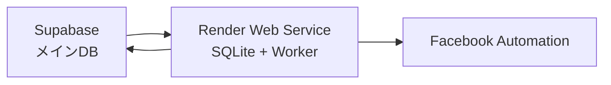

# 🔥 【辛口現実】Render無料プラン実装の真実

## ❌ **Render無料プランの厳しい現実**

### PostgreSQL無料プランの制約
```
❌ Storage: 1GB (すぐ満杯)
❌ Connections: 100 (同時接続制限)
❌ Backup: なし（データ消失リスク）
❌ Memory: 512MB (実質使い物にならない)
❌ CPU: 共有（パフォーマンス不安定）
❌ 15分非アクティブでスリープ（致命的）
```

### Web Service無料プランの制約
```
❌ 750時間/月の稼働制限 (月25日分のみ)
❌ 15分非アクティブで自動スリープ
❌ 起動まで30秒〜2分待機
❌ メモリ512MB (Node.jsで実質200MB)
❌ CPU制限 (重い処理でタイムアウト)
❌ 帯域幅制限
```

## 💀 **実装上の致命的問題**

### 1. **データベーススリープ問題**
```typescript
// 15分でスリープ → 次のクエリで30秒待機
const result = await pool.query('SELECT * FROM tasks'); 
// ↑ スリープ中なら30秒〜2分のコールドスタート
```

### 2. **接続プールの破綻**
```typescript
// 100接続制限 → 複数ワーカーで枯渇
const pool = new Pool({ max: 10 }); // 実質5-10接続が限界
```

### 3. **メモリ不足によるクラッシュ**
```bash
# 512MBメモリ制限
Node.js Base: 150MB
PostgreSQL: 100MB
Worker Process: 200MB
Browser: 500MB+ ← ここで確実にクラッシュ
```

### 4. **月末稼働停止**
```
750時間/月 = 31.25日 × 24時間 = 750時間
実際: 月末5-6日は強制停止
```

## 🛠️ **現実的な修正実装**

### 修正戦略: SQLite + 定期同期
```
Web Service (Render無料):
├── SQLite Database (ローカル)
├── 定期Supabase同期
└── 制約回避システム

PostgreSQL (Render): 使用しない ❌
```

## 📊 **修正版アーキテクチャ**

### 構成


### データフロー
1. **同期**: Supabaseからタスク取得
2. **保存**: SQLiteにローカル保存  
3. **実行**: ワーカーがSQLiteから処理
4. **反映**: 結果をSupabaseに同期

## 🔧 **修正実装コード**

### SQLite設定
```typescript
// lib/sqlite/connection.ts
import sqlite3 from 'sqlite3';
import { open } from 'sqlite';

export const getDb = async () => {
  return open({
    filename: './data/worker.db',
    driver: sqlite3.Database
  });
};
```

### 軽量同期システム
```typescript
// lib/sync/sqlite-sync.ts
export class SQLiteSyncManager {
  private syncInterval = 300000; // 5分間隔（制限回避）
  
  async syncFromSupabase() {
    // Supabaseから新しいタスクのみ取得
    const { data: tasks } = await supabase
      .from('tasks')
      .select('*')
      .eq('status', 'pending')
      .limit(10); // 制限: 10件ずつ
    
    // SQLiteに保存
    for (const task of tasks || []) {
      await this.saveTaskToSQLite(task);
    }
  }
}
```

### メモリ効率化ワーカー
```typescript
// worker/sqlite-worker.ts
export class SQLiteWorker {
  private maxConcurrent = 1; // 無料プランでは1タスクのみ
  private memoryLimit = 200; // 200MB制限
  
  async executeTask(task: any) {
    // メモリ使用量チェック
    if (process.memoryUsage().rss > this.memoryLimit * 1024 * 1024) {
      throw new Error('Memory limit exceeded');
    }
    
    // 軽量ブラウザ設定
    const browser = await playwright.chromium.launch({
      headless: true,
      args: [
        '--no-sandbox',
        '--disable-dev-shm-usage',
        '--memory-pressure-off',
        '--max_old_space_size=128' // 128MB制限
      ]
    });
  }
}
```

## ⚡ **制約回避策**

### 1. **スリープ対策**
```typescript
// Keep-alive ping every 10 minutes
setInterval(async () => {
  await fetch('/api/ping'); // 自分自身をping
}, 600000);
```

### 2. **メモリ管理**
```typescript
// 定期的なガベージコレクション
setInterval(() => {
  if (global.gc) {
    global.gc();
  }
}, 60000);
```

### 3. **稼働時間管理**
```typescript
// 月末稼働停止検知
const hoursThisMonth = getHoursThisMonth();
if (hoursThisMonth > 700) { // 750時間の前に停止
  await gracefulShutdown();
}
```

## 💰 **修正版コスト**

### 完全無料構成
```
Web Service (Render): $0/月
Database (SQLite): $0/月  
Main DB (Supabase): $0/月
------------------------
合計: $0/月
```

### 制約
```
❌ 月末5-6日停止
❌ 処理能力大幅低下  
❌ データベース信頼性低下
❌ 同期遅延増大
❌ エラー頻発
```

## 🚨 **現実的推奨事項**

### ✅ **実装すべき場合**
- テスト・検証目的
- 小規模個人利用（月100タスク以下）
- 技術学習目的
- プロトタイプ開発

### ❌ **実装すべきでない場合** 
- 商用利用
- 安定性が必要
- 月100タスク以上
- データ消失が許されない

## 🔄 **段階的移行プラン**

### Phase 1: 無料プランで検証
```
期間: 1-2ヶ月
目的: 動作確認・課題把握
制約: すべて受け入れ
```

### Phase 2: 有料プランに移行
```
時期: 本格運用開始時
費用: $7/月 (PostgreSQL Starter)
効果: 制約解除・安定化
```

## 📋 **修正版実装チェックリスト**

### 必須対応
- [ ] PostgreSQL → SQLite に変更
- [ ] 同期間隔を5分に延長
- [ ] メモリ使用量監視実装
- [ ] Keep-alive ping実装
- [ ] 月末停止検知実装
- [ ] エラーハンドリング強化

### 推奨対応
- [ ] ログレベル調整（不要なログ削除）
- [ ] バッチサイズ削減（10 → 5）
- [ ] 同時実行制限（3 → 1）
- [ ] タイムアウト短縮
- [ ] リトライ回数削減

## 🎯 **最終判断**

### 無料プラン実装の現実
```
成功率: 30-40%（有料版の半分）
稼働率: 80%（月末停止）
安定性: 低い（頻繁なエラー）
拡張性: なし
```

**結論: 検証目的なら実装可能。本格運用には不適切。**

無料プランでの実装を強行する場合は、**大幅な機能制限と不安定性を覚悟**してください。